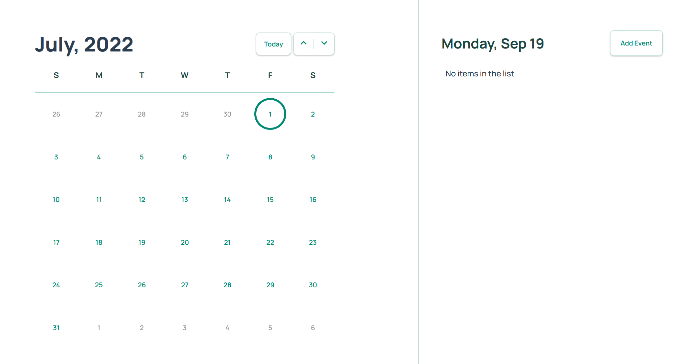
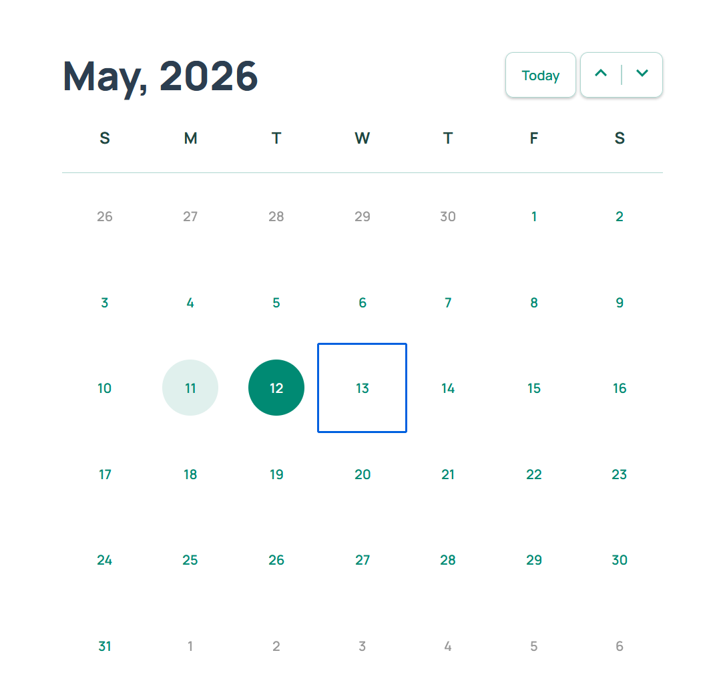
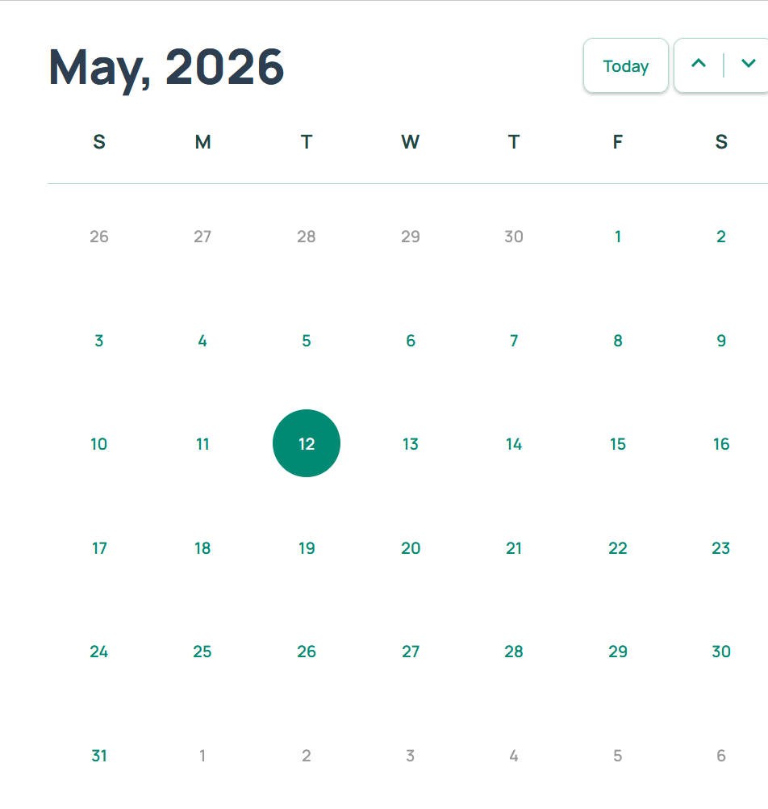

# Vue 3 Calendar

A simple calendar website written in an early version of Vue 3's composition API with the following features:

- Basic design with a task list for a selected date
    
    

- Proper focus, hover, and click styling 

    

- Keyboard navigation

  

- Ability to scroll through different months and years
- A quick-jump to the current date
- Data persistence with `localstorage`
